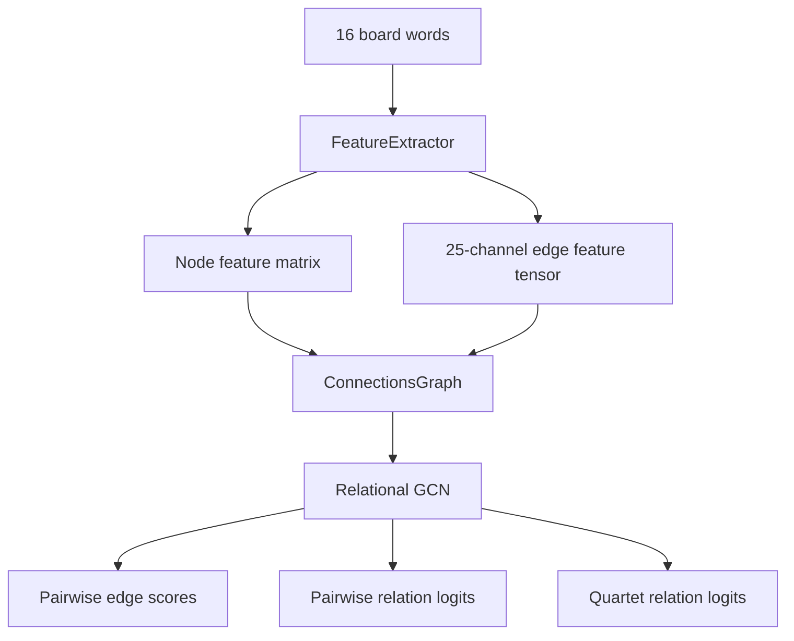

# Understanding GCN and the Connections Solver Architecture

This guide explains the non-RL half of the Connections solver: how a 16-word board becomes a graph, how graph features are built, and how the GCN predicts candidate groups. It reflects feature schema `13` and the current `EDGE_FEATURE_DIM = 25` implementation.

---

## 1. The Core Problem

In NYT-style *Connections*, the solver must partition 16 words into four hidden groups of four. This is hard because the board mixes several kinds of evidence:

1. **Semantic ambiguity**: `BAT` can be an animal, sports equipment, or a verb.
2. **Red herrings**: A word can plausibly fit more than one theme.
3. **Wordplay and fill-in-the-blank clues**: Groups can depend on spelling, sound, phrase completions, or hidden compounds rather than ordinary meaning.

The solver represents the board as a graph so it can reason over all pairwise relationships at once.

---

## 2. Board as a Multi-Relational Graph

Each board becomes a graph:

* **Nodes**: the 16 board words.
* **Edges**: every ordered pair of words, with a 25-dimensional feature vector.
* **Relations**: each edge feature dimension becomes one channel in the relational adjacency tensor.



The current feature extractor combines dictionary resources, local caches, neural sentence embeddings, deterministic wordplay checks, phonetic features, and compound-completion profiles.

---

## 3. Edge Features

Each ordered word pair `(w_i, w_j)` receives a 25-dimensional vector. These raw edge features are used in two places:

* As relation-specific adjacency channels for message passing.
* As direct inputs to the edge and group scoring heads, concatenated with learned node embeddings.

| Dim | Feature | Description | Main Target |
| :-- | :-- | :-- | :-- |
| 0 | `wordnet_path_similarity` | Maximum WordNet path similarity across synset pairs. | Synonyms, taxonomy neighbors |
| 1 | `wordnet_shared_hypernyms` | Binary flag for shared direct hypernyms. | Sibling concepts |
| 2 | `conceptnet_isa` | Direct ConceptNet `IsA` relation weight. | Category/type links |
| 3 | `conceptnet_synonym` | Direct ConceptNet `Synonym` relation weight. | Synonym categories |
| 4 | `conceptnet_related_to` | Direct ConceptNet `RelatedTo` relation weight. | Broad associations |
| 5 | `conceptnet_has_context` | Binary shared ConceptNet `HasContext` signal. | Domain/context overlap |
| 6 | `conceptnet_derived_from` | ConceptNet `DerivedFrom` or `FormOf` relation weight. | Morphology |
| 7 | `conceptnet_etymologically_related_to` | ConceptNet etymology relation weight. | Word origin links |
| 8 | `conceptnet_distinct_from` | ConceptNet `DistinctFrom` relation weight. | Contrast/opposition |
| 9 | `conceptnet_residual_forward` | Max uncovered ConceptNet relation from `w_i` to `w_j`. | Miscellaneous directed links |
| 10 | `conceptnet_residual_backward` | Max uncovered ConceptNet relation from `w_j` to `w_i`. | Miscellaneous reverse links |
| 11 | `clue_similarity` | TF-IDF similarity over cached clue/definition text. | Abstract semantic overlap |
| 12 | `is_anagram` | Binary anagram flag. | Letter rearrangement |
| 13 | `shared_prefix` | Binary shared prefix of length at least 3. | Surface word-form groups |
| 14 | `shared_suffix` | Binary shared suffix of length at least 3. | Suffix and morphology groups |
| 15 | `is_substring` | Binary flag when one word contains the other. | Hidden-word patterns |
| 16 | `length_distance` | Normalized character length difference. Inverted and thresholded for adjacency. | Same-length wordplay |
| 17 | `sentence_similarity` | Cosine similarity of SentenceTransformer embeddings. | Dense semantic similarity |
| 18 | `levenshtein_distance` | Normalized edit distance. Inverted and thresholded for adjacency. | Near-spellings |
| 19 | `phoneme_edit_distance` | Normalized CMUDict phoneme edit distance. Inverted and thresholded for adjacency. | Homophones and sound-alikes |
| 20 | `rhyme_match` | Binary match on rhyming phoneme suffix. | Rhyming categories |
| 21 | `soundex_match` | Binary Soundex code match. | Coarse phonetic similarity |
| 22 | `metaphone_match` | Binary Metaphone code match. | Phonetic similarity |
| 23 | `phoneme_overlap` | Jaccard overlap of phoneme sets. | Pronunciation overlap |
| 24 | `compound_fragment_shared` | Strongest shared cached ngram completion, e.g. `surf board` and `skate board`. | Fill-in-the-blank compounds |

### Edge Sparsification

Some channels are dense or distance-like. Before message passing, `ConnectionsGraph.get_multi_relational_adjacency()` transforms and filters them:

* `length_distance`, `levenshtein_distance`, and `phoneme_edit_distance` are converted to similarities with `1.0 - distance`.
* Continuous channels are thresholded to reduce background noise:
  * WordNet path similarity: `>= 0.15`
  * clue similarity: `>= 0.10`
  * sentence similarity: `>= 0.25`
  * phoneme overlap: `>= 0.60`
  * compound-fragment shared score: `>= 0.25`
* Relation self-loops are zeroed by default because the GCN layer has an explicit self-weight.
* Each relation channel is row-normalized after filtering.

---

## 4. Node Features

Each node combines three feature groups:

1. **Intrinsic metadata**: `15 + WORDNET_DOMAIN_TAG_DIM` dimensions.
2. **Board-context metadata**: 3 dimensions.
3. **Sentence embedding**: usually 768 dimensions from `sentence-transformers/all-mpnet-base-v2`.

The default node feature size is therefore:

```text
NODE_METADATA_DIM + DEFAULT_SENTENCE_EMBEDDING_DIM
```

### Intrinsic Metadata

| Slot | Feature | Description |
| :-- | :-- | :-- |
| 0 | `polysemy_count` | Number of WordNet synsets. |
| 1 | `word_len` | Character length. |
| 2 | `is_plural` | Ends in `S` and length is greater than 3. |
| 3 | `has_noun` | WordNet noun synset exists. |
| 4 | `has_verb` | WordNet verb synset exists. |
| 5 | `has_adj` | WordNet adjective synset exists. |
| 6 | `clue_len` | Length of cached clue/definition text. |
| 7 | `is_palindrome` | Orthographic palindrome flag. |
| 8 | `has_double_letter` | Adjacent repeated-letter flag. |
| 9 | `compound_prefix_valence` | WordNet-derived count of compounds where this token appears on the left. |
| 10 | `compound_suffix_valence` | WordNet-derived count of compounds where this token appears on the right. |
| 11 | `has_adverb` | WordNet adverb synset exists. |
| 12 | `wordnet_depth` | Maximum normalized WordNet taxonomy depth. |
| 13 | `conceptnet_is_a_count` | Normalized count of ConceptNet `IsA` edges. |
| 14 | `word_frequency` | Normalized English Zipf frequency from `wordfreq`, when available. |
| 15+ | `wordnet_domain_vector` | One-hot/multi-hot WordNet lexname domain tags. |

### Board-Context Metadata

After all edge features and sentence embeddings are available, the extractor adds:

| Feature | Description |
| :-- | :-- |
| `board_st_centroid_distance` | Distance from the word's sentence embedding to the board centroid. |
| `board_avg_edge_weight` | Average static edge strength from this word to other board words. |
| `board_max_edge_weight` | Maximum static edge strength from this word to another board word. |

---

## 5. Compound and Fill-in-the-Blank Signals

The solver has two compound-related feature families:

* **WordNet compound valence** is a node signal. It says a word often appears as a compound fragment, such as `surf` in `surfboard`.
* **Ngram shared completion** is an edge signal. It says two board words share a phrase completion, such as `surf board` and `skate board`.

The ngram cache is stored at `data/google_ngram_compound_cache.json`. The preferred warmer is now:

```bash
.venv/bin/python -m src.warm_ngram_compound_cache
```

That script overwrites the cache using `ngrams.dev/search` wildcard queries:

```text
token *
* token
```

It stores schema v2 metadata with source `ngrams.dev/search`, and `FeatureExtractor` accepts both the original Google Viewer-style schema and the new ngrams.dev schema.

This feature is designed for spaced phrase completions. It helps with categories like `SURF ___`, `SKATE ___`, and `SCORE ___` when the hidden word is `BOARD`. It does not fully solve concatenated hidden suffix categories such as `A/CAPRI/POP/UNI + CORN`, because those completions are single tokens: `ACORN`, `CAPRICORN`, `POPCORN`, `UNICORN`.

---

## 6. Relational GCN

The GCN updates node representations through relation-specific message passing. Each layer has:

* A self transformation, `W_self`, for the node's own features.
* A learned relation matrix for each of the 25 edge channels.
* A weighted aggregation over relation-specific adjacency matrices.

The implementation supports both unbatched tensors for individual boards and batched tensors for training. The relation adjacency tensor has shape:

```text
(num_relations, 16, 16)
```

or, in batched training:

```text
(batch_size, num_relations, 16, 16)
```

The model uses `LayerNorm`, ReLU, and dropout between GCN layers to stabilize training and reduce overfitting.

---

## 7. Scoring Heads

After message passing, the model scores both pairs and quartets.

### Pairwise Edge Score

For every ordered pair, the scoring head receives:

```text
[node_embedding_i || node_embedding_j || raw_edge_features_ij]
```

It predicts whether the two words belong to the same hidden category.

### Pairwise Relation Type

A parallel head receives the same pair representation and predicts the relation archetype, using the taxonomy in `src/relation_archetypes.py`. This auxiliary task helps separate semantic, word-form, phrase-completion, trivia, and no-relation cases.

### Quartet Relation Type

For each of the 1,820 possible four-word groups, the group relation head receives:

```text
[mean node summary || max node summary || mean edge summary || max edge summary]
```

It predicts the likely relation archetype for the whole quartet. Candidate scoring can use this signal as a small archetype-aware boost.

---

## 8. Candidate Generation

The GCN outputs a 16x16 matrix of pairwise same-category probabilities. Candidate generation then:

1. Scores every four-word combination using its six internal pair scores.
2. Penalizes uneven groups where one weak edge is hidden by several strong edges.
3. Filters or boosts candidates using group relation archetype confidence.
4. Searches for complete partitions: four disjoint groups that cover all 16 words.

The RL agent can later choose among candidate partitions during interactive solving, but the GCN path itself produces pairwise probabilities, relation logits, and candidate groups.

---

## 9. Known Feature Gap

The current compound completion channel is phrase-based, not concatenation-based. It can detect that `SURF` and `SKATE` share `BOARD` as a spaced completion, but it is weak for:

```text
A + CORN      = ACORN
CAPRI + CORN  = CAPRICORN
POP + CORN    = POPCORN
UNI + CORN    = UNICORN
```

A future feature should add lexicon-backed shared concatenated prefix/suffix detection. That would search for hidden fragments that form valid single words when prepended or appended to board tokens.
