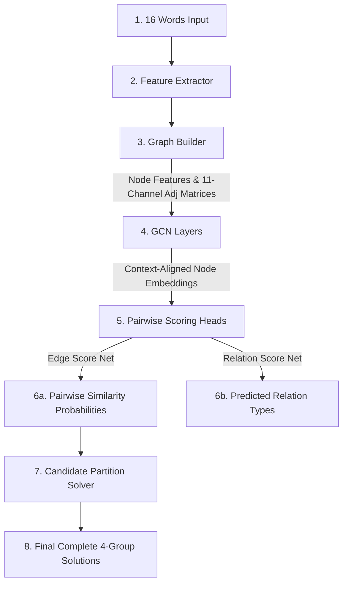

# Understanding GCN and the Connections Solver Architecture

This guide explains the architecture of the Connections solver (excluding the reinforcement learning agent) and how it uses a Graph Convolutional Network (GCN) to solve the puzzle. It assumes no prior knowledge of machine learning or graph theory.

---

## 1. The Core Problem: Solving NYT "Connections"

In the New York Times game *Connections*, you are given 16 words and must group them into 4 categories of 4 words each. This is incredibly difficult for traditional computer programs due to three main issues:

1. **Semantic Ambiguity (Multiple Meanings)**: A word like `BAT` can mean a flying mammal, a wooden baseball stick, or the action of blinking an eye. A computer looking at `BAT` in isolation doesn't know which meaning is active.
2. **Red Herrings (Overlaps)**: The game designers intentionally place overlapping words. For instance, there might be 5 words that look like NBA teams on the board, but only 4 belong to that group, while the 5th belongs to a category like "things that are hot."
3. **Wordplay and Trivia**: Categories aren't just synonyms. Sometimes they are based on spelling (e.g., anagrams like `KAYAK` and `LEVEL`), prefixes/suffixes (e.g., words starting with colors), or trivia.

Traditional text models look at words individually or in linear sentences. To solve Connections, a model must look at the **entire web of relationships** between all 16 words simultaneously.

---

## 2. Representing the Board as a "Graph"

To capture this web of relationships, we represent the 16-word board as a **Graph**:
* **Nodes (Vertices)**: The 16 words themselves.
* **Edges (Connections)**: The lines between words representing how similar or related they are.

### Building the Connections: The Feature Extractor
When a board is loaded, the system constructs the connections between all words using 11 different relationship channels (features) for edges, along with 7 metadata features for nodes.

```
                       ┌────────────────────────┐
                       │   Input: 16 Words      │
                       └───────────┬────────────┘
                                   ▼
                       ┌────────────────────────┐
                       │   Feature Extractor    │
                       └───────────┬────────────┘
                                   ▼
        ┌──────────────────────────────────────────────────────┐
        ▼ (Semantic Channels)           ▼ (Wordplay Channels)  ▼ (Deep AI Channels)
   - WordNet (Dictionary)          - Anagram detection    - SentenceTransformers
   - ConceptNet (Associations)     - Shared prefixes       (Contextual AI vectors)
   - Clue Cache (TF-IDF overlap)   - Shared suffixes
                                   - Word lengths & subs
```

Because there are 11 different types of relations, the graph is **multi-relational**. Instead of a single connection weight between two words, there are 11 distinct edge weights, each representing a different kind of connection.

---

## 3. Lexical and Semantic Feature Specifications

To solve connections requiring both dictionary definitions and abstract wordplay, the graph compiles a rich set of node and edge attributes:

### A. The 11 Edge Features (Relationship Channels)
Every pair of words $(v_i, v_j)$ is connected by an 11-dimensional feature vector, defining the 11 distinct channels of our multi-relational adjacency tensor:

| Dim | Feature Name | Description & Formulation | Target Cognitive Task |
| :--- | :--- | :--- | :--- |
| **0** | **WordNet Path Similarity** | Shortest path distance in the hierarchical WordNet taxonomy. Values range from 0 to 1. | Standard dictionary synonyms and hypernym/hyponym hierarchies. |
| **1** | **WordNet Shared Hypernym** | Binary indicator ($1$ or $0$) checking if both words share a direct parent synset (e.g., `ROBIN` and `SPARROW` share `BIRD`). | Capturing sibling concepts within taxonomy categories. |
| **2** | **ConceptNet Forward Weight** | Edge weight of the directed link from $v_i$ to $v_j$ in the ConceptNet common-sense database. | Capturing directed situational context (e.g., `COFFEE` $\rightarrow$ `CUP`). |
| **3** | **ConceptNet Backward Weight** | Edge weight of the directed link from $v_j$ to $v_i$ in ConceptNet. | Capturing reverse situational context (e.g., `CUP` $\leftarrow$ `COFFEE`). |
| **4** | **Clue Description TF-IDF** | Cosine similarity between TF-IDF vectors of LLM-generated definitions and context clues for each word. | Resolving abstract categories and phrases when dictionary entries are sparse. |
| **5** | **Is Anagram** | Binary indicator checking if $v_i$ is a permutation of characters of $v_j$ (e.g., `HEART` and `EARTH`). | Orthographic and spelling-level wordplay. |
| **6** | **Shares Prefix** | Binary indicator checking if both words share a starting substring of length $\ge 3$. | String-level prefix wordplay. |
| **7** | **Shares Suffix** | Binary indicator checking if both words share an ending substring of length $\ge 3$ (e.g., `-ship`, `-ing`). | Morphological and suffix-level wordplay. |
| **8** | **Is Substring** | Binary indicator checking if one word is entirely contained inside the other (e.g., `CAT` in `CATTLE`). | Identifying hidden sub-words. |
| **9** | **Length Difference** | Absolute difference in character lengths, normalized: $\frac{|len(v_i) - len(v_j)|}{\max(len(v_i), len(v_j))}$. | Grouping words of identical or similar length. |
| **10** | **Deep Semantic Similarity** | Cosine similarity of dense contextual representations generated by the **`all-mpnet-base-v2`** model. | Capturing deep, continuous semantic similarities and collocations. |

### B. The 7 Node Features (Word Metadata)
Each word has an independent 7-dimensional profile representing its grammatical and structural properties:

1. **Polysemy Count**: The number of synsets (dictionary definitions) the word has in WordNet. Highly polysemous words (e.g., `RUN` or `SET`) often act as intentional distractors/red herrings.
2. **Word Length**: The number of characters in the word.
3. **Is Plural**: A binary indicator checking if the word ends in `-S` and is longer than 3 characters.
4. **Has Noun**: Binary check if the word can function as a noun.
5. **Has Verb**: Binary check if the word can function as a verb.
6. **Has Adjective**: Binary check if the word can function as an adjective.
7. **Clue Description Length**: Character length of the LLM context clue description.

---

## 4. What is a GCN (Graph Convolutional Network)?

A Graph Convolutional Network is a type of neural network designed to process data structured as graphs. To understand how it works, let's look at how it differs from traditional computer vision networks.

### The Intuition of "Convolution"
* **In Images (Standard Convolution)**: A filter slides across pixels. It updates a pixel's color values by blending them with its physical neighbors (up, down, left, right).
* **In Graphs (Graph Convolution)**: A node has no fixed "up" or "down" neighbors. Instead, its neighbors are the nodes it is connected to. The GCN updates a word's meaning by blending it with the meanings of its **connected neighbors**.

```
    Traditional Image Grid            Graph Neighborhood (Connections)
      
         ┌───┬───┬───┐                         (SPARROW)
         │   │ ╪ │   │                             │
         ├───┼───┼───┤                             │ (shares category)
         │ ╪ │ O │ ╪ │                    (OWL)──(BAT)──(ROBIN)
         ├───┼───┼───┤                             │
         │   │ ╪ │   │                             │ (shares category)
         └───┴───┴───┘                         (EAGLE)
   (Updates pixel 'O' using            (Updates word 'BAT' using
    fixed grid neighbors '╪')            its semantic neighbors)
```

### The "Message Passing" Protocol
The GCN operates through a process called **Message Passing**, which happens in iterative rounds (layers):

1. **Send Messages**: Every word looks at its neighbors and receives a "message" containing their semantic profiles, scaled by how strong their connection is.
2. **Aggregate**: Each word sums up or averages the messages it receives.
3. **Update**: Each word updates its own internal representation by combining its starting profile with the aggregated neighbor messages.

#### What happens over multiple layers?
* **Layer 1**: Each word learns about its direct neighbors.
* **Layer 2**: Each word learns about its neighbors' neighbors. 

By the end of the GCN layers, words that belong to the same category will have swapped enough messages to "align" their profiles, forming tight, visible clusters.

---

## 4. The Problems the GCN Solves

### A. Resolving Ambiguity (Contextualization)
If `BAT` starts with an ambiguous profile, but is connected to `ROBIN`, `SPARROW`, and `OWL`:
* During message passing, it receives strong "bird/flying animal" messages from them.
* It receives no "baseball" messages because there are no baseball words on the board.
* The representation of `BAT` shifts towards "flying animal", resolving the ambiguity.

### B. Filtering out Noise (Red Herrings)
If `HEAT` is connected to both NBA Teams (`BUCKS`, `JAZZ`) and Hot Things (`SUN`, `FIRE`):
* The GCN propagates signals from both groups.
* The network learns which grouping forms a complete, harmonious 4-word cluster. 
* By evaluating the global context, it determines which set of connections is a stronger match, filtering out the red herring connection.

---

## 5. Non-RL System Architecture

Here is how the data flows through the non-RL system to generate solutions:



### Explanation of the Steps:
1. **16 Words Input**: The words on the board.
2. **Feature Extractor**: Pulls metadata (length, parts of speech) and calculates the 11 edge weights between all pairs.
3. **Graph Builder**: Compiles this data into PyTorch tensors.
4. **GCN Layers**: Runs message passing (with `LayerNorm` and `Dropout` for stability) to align node representation profiles based on their neighbors.
5. **Pairwise Scoring Heads**: Examines the final embeddings of node pairs.
6. **Output Predictions**:
   - **Edge Score Net**: Predicts the probability (0.0 to 1.0) that two words belong to the same category.
   - **Relation Score Net**: Categorizes the connection type (Synonym, Wordplay, Phrase Completion, Trivia, or Morphology).
7. **Candidate Partition Solver**: Employs a backtracking algorithm to find 4 mutually exclusive groups of 4 words that cover all 16 words perfectly.
8. **Final Solutions**: Outputs the solved category groupings.
