```mermaid
timeline
    title Model Development Milestones
    Phase 1 : Core Architecture Setup : Preprocessed Graph Cache (v1)
    Phase 2 : Feature Debugging : TF-IDF Fix : Schema Version Invalidation : Length Adjacency Sparsification
    Phase 3 : Scoring Improvements : Quartet Score Penalty : Raw Baseline Scorer
    Phase 4 (Refactoring) : GCN Stability & Normalization : Input LayerNorm : Edge Logits BCE : Row-normalized Adj : Ignored Diagonal Loss
    Phase 5 : Performance Tuning : Batched RL Optimizer : Full Cache Re-preprocessing : Raw Visualizations Update
    Phase 6 : Ranking Objective Tuning : Increased Groupwise Loss Weight
    Phase 7 : Semantic Node Embeddings & Edge-Conditioned Scoring : ST Node Features : Linear Input Projection : Scoring Head Concatenation : Schema v5
    Phase 8 : Archetype Taxonomy Refactor : DeepSeek Flash Labeling : Relation Loss Re-enabled : Archetype Schema v2
    Phase 9 : Group-Level Archetype Supervision : Quartet Relation Head : Archetype-Aware Candidate Scoring
    Phase 10 : Strong Orthographic Node Features : Palindrome Flags : Double Letters : Compound Fragment Valence : Schema v6
    Phase 11 : Board-Context Node Features : Static Edge Stats : Schema v7
    Phase 12 : KG and Frequency Node Features : WordNet Domains : Schema v8
    Phase 13 : ConceptNet Relation Decomposition : Relation-Type + Residual Edge Channels : Schema v10
    Phase 14 : Phonetic Edge Features : CMUDict Rhymes & Phoneme Edit Distance : Jellyfish Metaphone : Schema v11
    Phase 15 : Metrics Pipeline Redesign : GCN/DQN History Plots : Model Registry : CLI Comparison Tool : Worst-10 Error Analysis
    Phase 16 : Data Integrity Cleanup : Remove Full-Corpus Collocation Feature : Drop Malformed Puzzle : Schema v12
    Phase 17 : Archetype Regularization & Gated Boosting : Gated Candidate Scoring : MLP Head Dropout : DropEdge p=0.2 : Class-Balanced Group Weights
    Phase 18 : Google Ngrams Compound Fragment Edge Feature : Shared Wildcard Completion Channel : Schema v13
    Phase 20 : Ngrams.dev Cache Warmer : Search-Based Compound Profiles : Cache Schema v2
```

# Connections Solver Model Development Timeline

This timeline documents the key development phases, major checkpoints, feature updates, and architectural changes implemented to optimize the Connections GCN + RL solver.

---

---

## Phase 20: Ngrams.dev Cache Warmer
* **Milestone**: Replaced the planned full Google Books gzip-stream cache fill path with a faster `ngrams.dev/search` wildcard cache warmer.
* **Major Changes**:
  - **Search-Based Profiles**: Added an overwrite-oriented cache warmer that queries `token *` and `* token` for puzzle vocabulary, normalizes total corpus scores, and writes `google_ngram_compound_cache.json` profiles directly.
  - **Cache Schema Version 2**: Accepted `ngrams.dev/search` metadata in `FeatureExtractor` while preserving the existing profile shape used by the compound-fragment edge feature.

---

## Phase 17: Archetype Regularization & Gated Boosting
* **Milestone**: Resolved GCN overfitting and auxiliary archetype classifier collapse.
* **Major Changes**:
  - **Scoring Head Dropout**: Added `nn.Dropout(p=0.3)` to the classification heads to regularize the GCN prediction maps.
  - **Gated Candidate Boosting**: Implemented a threshold-and-margin gate (`confidence >= 0.45` and `margin >= 0.10`) to prevent low-confidence false positives from receiving score boosts.
  - **DropEdge & Weight Decay**: Increased DropEdge rate to `0.2` and weight decay to `1e-4` to delay GCN overfitting.
  - **Class-Balanced Group Weights**: Implemented a dynamic balanced weight formula with `NO_RELATION` weight set to `0.15` to successfully uncollapse the group relation classifier.

---

## Phase 16: Data Integrity Cleanup
* **Milestone**: Removed a leakage-prone node feature and a malformed puzzle row to restore cleaner train/validation/test semantics.
* **Major Changes**:
  - **Removed Full-Corpus Collocation Feature**: Deleted the in-domain `common_collocation_count` node feature because it derived counts from the entire `data/connections.json` corpus before splitting, contaminating validation/test features.
  - **Feature Schema Version 12**: Bumped `FEATURE_SCHEMA_VERSION` so stale preprocessed graph caches with the removed node slot are invalidated.
  - **Malformed Puzzle Removal**: Removed puzzle `660` (`2025-04-01`) because all 16 members were empty strings, collapsing `word_to_cat` and producing an all-positive adjacency matrix.
  - **Dataset Integrity Test**: Added regression coverage requiring each puzzle to have four groups, four non-empty members per group, and 16 unique board words.

---

## Phase 1: Core Architecture Setup
* **Milestone**: The foundational skeleton of the Connections solver is established.
* **Key Components**:
  - `dataset.py`: Loads the raw NYT Connections puzzle dataset.
  - `features.py`: Extracts 11 unique edge features (dictionary, wordplay, and semantic dimensions) and node metadata.
  - `graph.py`: Builds a 16-node graph for each puzzle.
  - `gcn.py`: Implements a multi-relational `RelationalGCNLayer` and a `ConnectionsGINE` network backbone.
  - `env.py`: Models the Connections board as a custom Gymnasium environment.
  - `rl_agent.py`: Sets up a Deep Q-Network (DQN) agent to navigate candidate selections.
  - `preprocess.py`: Introduces graph precomputation to cache ConceptNet, WordNet, and SentenceTransformer embeddings, exporting `data/preprocessed_graphs.pt`.

---

## Phase 2: Feature Debugging & Adjacency Cleaning
* **Milestone**: Resolved critical bugs in the feature pipeline and controlled graph density.
* **Major Changes**:
  - **TF-IDF Bug Fix**: Discovered and resolved a bug in `features.py` where the clue similarity TF-IDF lookup was trapped beneath a return statement, rendering feature channel `4` silently disabled.
  - **Preprocessed Graph Invalidation**: Introduced `FEATURE_SCHEMA_VERSION` (Version 3) to the preprocessing script to prevent the training pipeline from loading stale precomputed graphs after code updates.
  - **Length-Similarity Sparsification**: Replaced the dense length-similarity adjacency channel (which connected almost all nodes) with a strict threshold filter ($\ge 0.90$) to reduce background message-passing noise.

---

## Phase 3: Candidate Scoring Refinement
* **Milestone**: Improved candidate evaluation metrics to align with the game's actual objectives.
* **Major Changes**:
  - **Quartet Scorer Optimization**: Replaced the basic arithmetic mean scoring of candidate groups (which mistakenly ranked "3 correct words + 1 popular hub word" highly) with a penalized scoring function:
    $$\text{score} = \text{mean} - 0.25 \times (\text{max} - \text{min})$$
    This penalizes candidate groups that contain even a single weak link.
  - **Raw Candidate Baseline**: Added a raw heuristic baseline (`src/raw_candidates.py`) to measure feature quality without GCN training. On a 40-puzzle subset, the raw baseline scored an MRR of `0.1470`, highlighting underperformance in the early GCN setup.

---

## Phase 4: GCN Stability & Normalization (Architectural Refactor)
* **Milestone**: Re-designed GCN training parameters and graph structures to combat oversmoothing and numerical instability.
* **Major Changes**:
  - **Input Feature Scaling**: Added an input `LayerNorm` to the GCN and GINE backbones to handle scale imbalances between continuous features (e.g. `clue_len`) and binary indicators.
  - **GCN Regularization**: Added `Dropout` ($p=0.1$) and inter-layer `LayerNorm` to prevent overfitting.
  - **Edge Logits BCE**: Swapped the unstable `F.binary_cross_entropy` (which ran on probabilities and regularly produced `NaN`s) for `F.binary_cross_entropy_with_logits` by removing the `Sigmoid` layer from the edge head during training.
  - **Adjacency Sparsification**: Added hard thresholds in `get_multi_relational_adjacency` for WordNet ($0.15$), Clue TF-IDF ($0.10$), and SentenceTransformer ($0.25$) similarities to sparsify the graph and mitigate oversmoothing.
  - **Adjacency Row Normalization**: Row-normalized each relation's adjacency matrix to stabilize message propagation scales across nodes.
  - **Diagonal Loss Masking**: Modified the auxiliary archetype target matrix so that node self-loops are set to `-100` (ignored), preventing the relation classifier from wasting capacity on self-identities.

---

## Phase 5: RL Performance Tuning & Full Data Refresh
* **Milestone**: Resolved bottlenecks in DQN training speed and refreshed dataset artifacts.
* **Major Changes**:
  - **DQN Batch Optimizer**: Rewrote the DQN `train_step` to accumulate gradients across sample batches and run a single optimizer step, replacing the extremely slow sample-by-sample loop updates.
  - **Full Preprocessing Run**: Re-processed all 1,097 puzzles in the dataset using the updated feature rules.
  - **Baseline Visualizations Update**: Refreshed all raw baseline cluster plots under `visualizations/raw` to reflect the updated, sparsified feature metrics.

---

## Phase 6: Ranking Objective Tuning
* **Milestone**: Increased direct pressure on exact 4-word candidate ranking after raw graph scoring outperformed the trained GCN on validation MRR.
* **Major Changes**:
  - **Groupwise Loss Weight Trial**: Increased `GROUPWISE_LOSS_WEIGHT` in `src/gcn.py` from `0.5` to `1.0` so GCN training emphasizes exact-group ranking more strongly relative to pairwise BCE.
  - **Expected Evaluation**: Retrain the GCN and compare validation MRR against the previous saved run (`0.0967`) and the raw baseline (`0.1458`) to check whether stronger ranking supervision closes the gap without destabilizing edge probabilities.

---

## Phase 7: Semantic Node Embeddings & Edge-Conditioned Scoring
* **Milestone**: Resolved representation collapse and oversmoothing bottlenecks in GCN link prediction by enriching node features and edge-conditioned scoring.
* **Major Changes**:
  - **Semantic Node Features**: Included the 768-dimensional SentenceTransformer embeddings directly in the GCN input node features, expanding node dimensions from 7 to 775.
  - **Linear Input Projection**: Added a trainable projection layer `self.input_proj` in `ConnectionsGCN` to reduce input features from 775 dimensions to 16 dimensions before Relational GCN message passing, preventing parameter explosion.
  - **Edge-Conditioned Scoring Head**: Modified the edge scoring head to concatenate raw pairwise edge features directly with the GCN node embeddings `[h_i || h_j || raw_edge_features]` (increasing input dimensions from 32 to 44). This bypasses the node metadata bottleneck, giving the link predictor direct access to the 12 similarity dimensions.
  - **Feature Schema Version 5**: Bumped `FEATURE_SCHEMA_VERSION` in `src/features.py` to `5` to invalidate stale caches and trigger full graph re-preprocessing with semantic embeddings.
  - **Dynamic GCN Input Dimension Resolution**: Replaced the hardcoded GCN input size of `7` in `main.py`, `src/train.py`, and `src/evaluate_archetypes.py` with dynamic detection based on the preprocessed graph features.
  - **Ranking Loss Tuning**: Lowered `GROUPWISE_LOSS_WEIGHT` to `0.1` to prevent representation collapse while retaining the differentiable, gradient-consistent soft-min candidate score formulation for ranking loss.

---

## Phase 8: Category Archetype Refactor & Relabeling Pipeline
* **Milestone**: Replaced broad relation labels with mechanism-based category archetypes and added an auditable DeepSeek Flash relabeling workflow.
* **Major Changes**:
  - **Mechanism-Based Taxonomy**: Expanded the relation head target space to `NO_RELATION` plus eight positive archetypes: semantic sets, near-synonyms, named entities, word form, sound/spelling, wordplay transforms, fill-in-the-blank, and common phrases.
  - **Legacy Label Normalization**: Added compatibility mapping from old labels (`SYNONYM`, `WORDPLAY`, `PHRASE_COMPLETION`, `TRIVIA_ENCYCLOPEDIC`, `MORPHOLOGY`) into the new taxonomy so old or low-confidence categories remain trainable.
  - **Relation Loss Re-enabled**: Set `RELATION_LOSS_WEIGHT` to `0.05` and added clipped inverse-frequency class weights with `NO_RELATION` downweighted to `0.25`.
  - **DeepSeek Flash Labeling Script**: Added `src/label_archetypes_deepseek.py` to label one puzzle per request with `deepseek-v4-flash`, partially apply high-confidence labels, and write a review report for uncertain categories.
  - **Archetype Cache Schema**: Added `RELATION_ARCHETYPE_SCHEMA_VERSION = 2` to invalidate preprocessed graph caches whose embedded `word_to_cat` labels use the old archetype schema.

---

## Phase 9: Group-Level Archetype Supervision
* **Milestone**: Shifted archetype learning from pair-only supervision toward complete 4-word candidate groups.
* **Major Changes**:
  - **Quartet Archetype Head**: Added a group-level relation classifier over all 1,820 candidate quartets, using pooled node embeddings and pooled raw edge features.
  - **Hard Negative Group Labels**: Trains the group classifier on the four true categories plus high-scoring false groups labeled as `NO_RELATION`, matching the candidate-selection problem more directly than pair-only archetype targets.
  - **Archetype-Aware Candidate Scoring**: Candidate ranking now adds a small boost when the group classifier is confident in a positive archetype over `NO_RELATION`, allowing archetype evidence to influence partition search and RL action candidates.
  - **Candidate Summary Display**: Validation summaries prefer the group-level archetype prediction for each candidate group and include its positive confidence plus `NO_RELATION` confidence.

---

## Phase 10: Strong Orthographic Node Features
* **Milestone**: Added deterministic node metadata for high-signal word-form categories and compound-fragment behavior.
* **Major Changes**:
  - **Orthographic Metadata**: Expanded node metadata from 7 to 11 dimensions with palindrome, adjacent double-letter, WordNet compound-prefix valence, and WordNet compound-suffix valence features.
  - **Feature Schema Version 6**: Bumped `FEATURE_SCHEMA_VERSION` to `6`; existing preprocessed graph caches must be rebuilt before training or evaluation.
  - **Checkpoint Compatibility Guard**: GCN checkpoint checks now validate the input projection width so schema-v5 models fail cleanly and require retraining.

---

## Phase 11: Strong Board-Context Node Features
* **Milestone**: Added static board-level node signals for semantic outlier detection and graph hub strength.
* **Major Changes**:
  - **Board-Context Metadata**: Expanded full node metadata from 11 to 14 dimensions with SentenceTransformer centroid distance, average static relation strength, and max static relation strength.
  - **Static Edge Strength Summary**: Edge stats use the same distance-to-similarity conversions and sparsification thresholds as GCN adjacency setup, exclude self-loops, and avoid row normalization so hub/decoy strength remains visible.
  - **Feature Schema Version 7**: Bumped `FEATURE_SCHEMA_VERSION` to `7`; preprocessed graph caches and existing GCN checkpoints must be rebuilt before training or evaluation.

---

## Phase 12: Strong KG and Frequency Node Features
* **Milestone**: Added knowledge-graph, WordNet taxonomy/domain, and frequency/register metadata to improve semantic-set, named-entity, common-phrase, and fill-in-the-blank signals.
* **Major Changes**:
  - **KG/Register Metadata**: Expanded full node metadata from 14 to 63 dimensions with adverb POS, normalized WordNet max depth, offline ConceptNet `IsA` count, normalized `wordfreq` Zipf frequency, in-domain collocation participation, and a fixed WordNet lexname multi-hot vector.
  - **Offline-Safe Feature Extraction**: ConceptNet `IsA` node metadata uses local cache/SQLite data only; frequency uses `wordfreq` when installed and falls back to the in-repo collocation prior.
  - **Feature Schema Version 8**: Bumped `FEATURE_SCHEMA_VERSION` to `8`; preprocessed graph caches and existing GCN checkpoints must be rebuilt before training or evaluation.

---

## Phase 13: ConceptNet Relation-Type Edge Features
* **Milestone**: Replaced the two collapsed ConceptNet edge weights with seven relation-specific channels.
* **Major Changes**:
  - **ConceptNet Decomposition**: `src/features.py` now emits `IsA`, `Synonym`, `RelatedTo`, shared `HasContext`, `DerivedFrom`/`FormOf`, `EtymologicallyRelatedTo`, and `DistinctFrom` edge features from the existing ConceptNet cache.
  - **Residual ConceptNet Aggregates**: Added forward/backward residual aggregate channels for direct ConceptNet relation types not already covered by the decomposed features, preserving broad semantic signal without double-counting modeled relation families.
  - **Feature Schema Version 10**: Bumped `FEATURE_SCHEMA_VERSION` to `10` and `EDGE_FEATURE_DIM` to `19`; preprocessed graph caches and GCN checkpoints must be rebuilt.
  - **Raw Baseline Alignment**: Updated raw candidate scoring and raw graph visualization to use named feature constants and the decomposed ConceptNet channels.

---

## Phase 14: Phonetic Edge Features
* **Milestone**: Integrated strong pairwise phonetic edge features to enable detection of sound-based category themes (`SOUND_OR_SPELLING`).
* **Major Changes**:
  - **Phonetic Edge Features**: Introduced 5 new dimensions: Phoneme Edit Distance (CMUDict), Rhyme Match, Soundex Match, Metaphone Match (via `jellyfish`), and Phoneme Overlap Jaccard ratio.
  - **CMUDict Cleaning/Splitting**: Implemented hyphen/space splitting during phonetic extraction, improving lexical coverage by resolving compound/multi-word board terms.
  - **Feature Schema Version 11**: Bumped `FEATURE_SCHEMA_VERSION` to `11` and `EDGE_FEATURE_DIM` to `24`; preprocessed graph caches must be rebuilt.
  - **Graph Adjacency & Thresholding**: Applied distance-to-similarity inversion for Phoneme Edit Distance and set sparsification thresholds for continuous phonetic features.
  - **Raw Baseline Evaluation**: Evaluated raw features on validation split (`109` puzzles) and confirmed that manual weighting of phonetic features slightly improves validation MRR (from `0.0959` to `0.0962`) when correctly scaled to minimize background noise.

---

## Phase 15: Pipeline Metrics Redesign & Historical Evaluation
* **Milestone**: Redesigned the model evaluation and metrics pipeline to support historical logs, automatic checkpoint registration, worst-performing puzzle diagnostics, and CLI checkpoint comparisons.
* **Major Changes**:
  - **Epoch/Episode History Plots**: Implemented JSON logging of training histories and automatically generates learning curve visualizations (`visualizations/gcn_learning_curves.png` and `visualizations/dqn_learning_curves.png`) displaying losses, validation MRRs, rewards, win rates, and exploration epsilon trends over epochs/episodes.
  - **Model Registry (`models/model_registry.json`)**: Added a persistent, cataloged model registry storing flat metrics, feature/relation schemas, and detailed archetype-level performance maps for `gcn_best`, `gcn_previous_best`, `gcn_all_time_best`, and `raw_baseline`.
  - **Worst-Performing Puzzle Diagnostics**: Validation evaluates per-puzzle MRRs to locate the 10 hardest validation boards, outputting a detailed report in `visualizations/val_puzzles/error_analysis.md` summarizing worst puzzles, exact ground-truth groups, and mapping relation archetype failure ratios.
  - **Interactive Model Comparison CLI**: Added `--compare-models` to `main.py` which takes two models, parses registry metrics or evaluates checkpoints on the fly, logs delta metric tables to stdout, and compiles a comprehensive side-by-side Markdown report to `visualizations/model_comparison_report.md`.

---

## Phase 18: Google Ngrams Compound Fragment Edge Feature
* **Milestone**: Added a cache-backed pairwise compound-fragment edge channel for fill-in-the-blank categories.
* **Major Changes**:
  - **Ngram Compound Edge**: Expanded `EDGE_FEATURE_DIM` to `25` with `compound_fragment_shared`, scoring word pairs that share a strong Google Books Ngrams wildcard completion such as `SURF` and `SKATE` before `board`.
  - **Offline/Live Cache Split**: Added a versioned `data/google_ngram_compound_cache.json`; training and preprocessing default to cache-only, while `src/preprocess.py --ngram-live` and `main.py --solve` can populate missing live profiles.
  - **Streaming Cache Warmer**: Added `src/warm_ngram_compound_cache.py` to stream Google Books `eng_2019` 2-gram gzip exports, aggregate `1980-2019` match counts for dataset vocabulary, filter filler completions while preserving phrasal particles, and atomically warm `data/google_ngram_compound_cache.json`.
  - **Feature Schema Version 13**: Bumped `FEATURE_SCHEMA_VERSION` to `13`; preprocessed graph caches and GCN checkpoints must be rebuilt.
