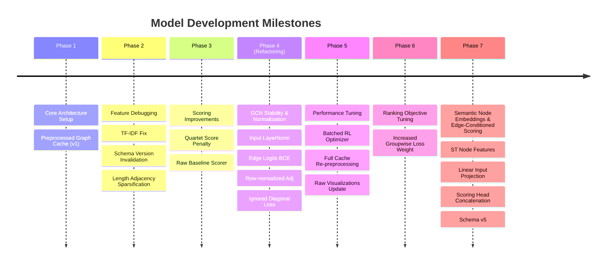

# Connections Solver Model Development Timeline

This timeline documents the key development phases, major checkpoints, feature updates, and architectural changes implemented to optimize the Connections GCN + RL solver.

---

---

## Phase 1: Core Architecture Setup
* **Milestone**: The foundational skeleton of the Connections solver is established.
* **Key Components**:
  - `dataset.py`: Loads the raw NYT Connections puzzle dataset.
  - `features.py`: Extracts 11 unique edge features (dictionary, wordplay, and semantic dimensions) and node metadata.
  - `graph.py`: Builds a 16-node graph for each puzzle.
  - `gcn.py`: Implements a multi-relational `RelationalGCNLayer` and a `ConnectionsGINE` network backbone.
  - `env.py`: Models the Connections board as a custom Gymnasium environment.
  - `rl_agent.py`: Sets up a Deep Q-Network (DQN) agent to navigate candidate selections.
  - `preprocess.py`: Introduces graph precomputation to cache ConceptNet, WordNet, and SentenceTransformer embeddings, exporting `data/preprocessed_graphs.pt`.

---

## Phase 2: Feature Debugging & Adjacency Cleaning
* **Milestone**: Resolved critical bugs in the feature pipeline and controlled graph density.
* **Major Changes**:
  - **TF-IDF Bug Fix**: Discovered and resolved a bug in `features.py` where the clue similarity TF-IDF lookup was trapped beneath a return statement, rendering feature channel `4` silently disabled.
  - **Preprocessed Graph Invalidation**: Introduced `FEATURE_SCHEMA_VERSION` (Version 3) to the preprocessing script to prevent the training pipeline from loading stale precomputed graphs after code updates.
  - **Length-Similarity Sparsification**: Replaced the dense length-similarity adjacency channel (which connected almost all nodes) with a strict threshold filter ($\ge 0.90$) to reduce background message-passing noise.

---

## Phase 3: Candidate Scoring Refinement
* **Milestone**: Improved candidate evaluation metrics to align with the game's actual objectives.
* **Major Changes**:
  - **Quartet Scorer Optimization**: Replaced the basic arithmetic mean scoring of candidate groups (which mistakenly ranked "3 correct words + 1 popular hub word" highly) with a penalized scoring function:
    $$\text{score} = \text{mean} - 0.25 \times (\text{max} - \text{min})$$
    This penalizes candidate groups that contain even a single weak link.
  - **Raw Candidate Baseline**: Added a raw heuristic baseline (`src/raw_candidates.py`) to measure feature quality without GCN training. On a 40-puzzle subset, the raw baseline scored an MRR of `0.1470`, highlighting underperformance in the early GCN setup.

---

## Phase 4: GCN Stability & Normalization (Architectural Refactor)
* **Milestone**: Re-designed GCN training parameters and graph structures to combat oversmoothing and numerical instability.
* **Major Changes**:
  - **Input Feature Scaling**: Added an input `LayerNorm` to the GCN and GINE backbones to handle scale imbalances between continuous features (e.g. `clue_len`) and binary indicators.
  - **GCN Regularization**: Added `Dropout` ($p=0.1$) and inter-layer `LayerNorm` to prevent overfitting.
  - **Edge Logits BCE**: Swapped the unstable `F.binary_cross_entropy` (which ran on probabilities and regularly produced `NaN`s) for `F.binary_cross_entropy_with_logits` by removing the `Sigmoid` layer from the edge head during training.
  - **Adjacency Sparsification**: Added hard thresholds in `get_multi_relational_adjacency` for WordNet ($0.15$), Clue TF-IDF ($0.10$), and SentenceTransformer ($0.25$) similarities to sparsify the graph and mitigate oversmoothing.
  - **Adjacency Row Normalization**: Row-normalized each relation's adjacency matrix to stabilize message propagation scales across nodes.
  - **Diagonal Loss Masking**: Modified the auxiliary archetype target matrix so that node self-loops are set to `-100` (ignored), preventing the relation classifier from wasting capacity on self-identities.

---

## Phase 5: RL Performance Tuning & Full Data Refresh
* **Milestone**: Resolved bottlenecks in DQN training speed and refreshed dataset artifacts.
* **Major Changes**:
  - **DQN Batch Optimizer**: Rewrote the DQN `train_step` to accumulate gradients across sample batches and run a single optimizer step, replacing the extremely slow sample-by-sample loop updates.
  - **Full Preprocessing Run**: Re-processed all 1,097 puzzles in the dataset using the updated feature rules.
  - **Baseline Visualizations Update**: Refreshed all raw baseline cluster plots under `visualizations/raw` to reflect the updated, sparsified feature metrics.

---

## Phase 6: Ranking Objective Tuning
* **Milestone**: Increased direct pressure on exact 4-word candidate ranking after raw graph scoring outperformed the trained GCN on validation MRR.
* **Major Changes**:
  - **Groupwise Loss Weight Trial**: Increased `GROUPWISE_LOSS_WEIGHT` in `src/gcn.py` from `0.5` to `1.0` so GCN training emphasizes exact-group ranking more strongly relative to pairwise BCE.
  - **Expected Evaluation**: Retrain the GCN and compare validation MRR against the previous saved run (`0.0967`) and the raw baseline (`0.1458`) to check whether stronger ranking supervision closes the gap without destabilizing edge probabilities.

---

## Phase 7: Semantic Node Embeddings & Edge-Conditioned Scoring
* **Milestone**: Resolved representation collapse and oversmoothing bottlenecks in GCN link prediction by enriching node features and edge-conditioned scoring.
* **Major Changes**:
  - **Semantic Node Features**: Included the 768-dimensional SentenceTransformer embeddings directly in the GCN input node features, expanding node dimensions from 7 to 775.
  - **Linear Input Projection**: Added a trainable projection layer `self.input_proj` in `ConnectionsGCN` to reduce input features from 775 dimensions to 16 dimensions before Relational GCN message passing, preventing parameter explosion.
  - **Edge-Conditioned Scoring Head**: Modified the edge scoring head to concatenate raw pairwise edge features directly with the GCN node embeddings `[h_i || h_j || raw_edge_features]` (increasing input dimensions from 32 to 44). This bypasses the node metadata bottleneck, giving the link predictor direct access to the 12 similarity dimensions.
  - **Feature Schema Version 5**: Bumped `FEATURE_SCHEMA_VERSION` in `src/features.py` to `5` to invalidate stale caches and trigger full graph re-preprocessing with semantic embeddings.
  - **Dynamic GCN Input Dimension Resolution**: Replaced the hardcoded GCN input size of `7` in `main.py`, `src/train.py`, and `src/evaluate_archetypes.py` with dynamic detection based on the preprocessed graph features.
  - **Ranking Loss Tuning**: Lowered `GROUPWISE_LOSS_WEIGHT` to `0.1` to prevent representation collapse while retaining the differentiable, gradient-consistent soft-min candidate score formulation for ranking loss.
